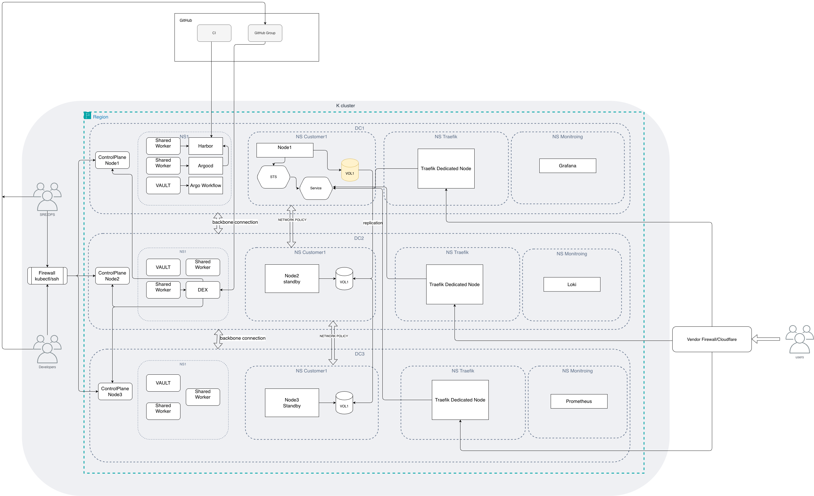

# Cluster architecture POC

> Start here: see [READ_IT_FIRST.md](READ_IT_FIRST.md) for assumptions and scope before reading this architecture.

## Table of Contents

- [Architecture summary](#architecture-summary)
  - [Resilience and Recovery](#resilience-and-recovery)
  - [Backup/Restore](#backuprestore)
  - [Scalability](#scalability)
  - [Migration](#migration)
  - [Monitoring](#monitoring)
  - [Security & Tooling](#security--tooling)
  - [Cluster topology, environments & access](#cluster-topology-environments--access)
  - [Operational guardrails (multi-tenant, upgrades, sizing)](#operational-guardrails-multi-tenant-upgrades-sizing)
  - [Open questions](#open-questions)

## Architecture summary

### Resilience and Recovery

- **Storage choice**: I choose Longhorn replicated volumes with **default replica count 3**, placed on **different nodes** (and across failure domains where the provider allows), because it preserves data through pod and **single-node** failures while easing **operational** work (e.g. cordon/drain + rebuild still leaves **two** healthy copies during maintenance—tighter than a two-replica minimum).
- **Replica count trade-off (tunable per case):** three replicas increase **disk cost** and **synchronous replication / write amplification** versus two; two replicas reduce cost and copy overhead but raise operational care during upgrades. `**numberOfReplicas`** is adjusted **per `StorageClass` / tenant tier** (e.g. `3` prod default, `2` cost-sensitive or non-prod) rather than one global guess.
- **Trade-off**: I accept some write-performance overhead versus local-only storage in exchange for resilience.
- **Pod failure handling**: StatefulSet with PVC keeps data; pod restart/reschedule reattaches the same volume.
- **Node failure handling**: Longhorn promotes remaining replicas and rebuilds redundancy automatically after node recovery/replacement.
- **Health checks**: App provides HTTP endpoints; Kubernetes uses startupProbe (DB open/recovery), readinessProbe (safe to serve), conservative livenessProbe (deadlock/hang only).
- **Scheduling safety**: Add PodDisruptionBudget and anti-affinity/topology spread to reduce correlated disruptions.

One risk I see here is that network performance can become a bottleneck for heavy I/O rates (this needs validation during evaluation).

> “I selected Longhorn because it best satisfies the resilience and recovery requirements for this challenge. I considered OpenEBS LocalPV for its near-local-disk performance, but LocalPV ties data to a single node and does not inherently protect against node failure. In contrast, Longhorn provides multi-node volume replication, so pod restarts and single-node failures do not result in data loss, and replicas can be rebuilt automatically after recovery. I accept the write-performance overhead from synchronous replication as a deliberate trade-off for stronger durability and operational safety. I also note that application health remains application-owned (startup/readiness/liveness endpoints), while storage-level resilience is handled by Longhorn. This combination gives me a clear, generic Kubernetes approach to robust stateful storage without coupling the design to a single cloud provider.”

### Backup/Restore

- **Primary approach:** Longhorn **recurring backups** to S3-compatible storage, **CSI `VolumeSnapshot`** for point-in-time capture (see [longhorn](example/longhorn.yml)), and **restore / DR** orchestration via Argo Workflows (see [restore](example/argo_workflow_restore.md)). **Argo Workflows** fit well to automate restore, validation, and cutover steps.
- **Restic (migration bootstrap only):** The LVM + Restic YAML in [restic_restore](example/restic_restore_job.yml) is used as a **one-way bootstrap migration path** to copy data from legacy servers into a **new Longhorn PVC** in Kubernetes. After cutover, it is **not** my steady-state backup/restore strategy; ongoing protection and DR stay on Longhorn recurring backups + snapshots + restore workflows (see [longhorn](example/longhorn.yml) and [restore](example/argo_workflow_restore.md)). This keeps Restic scoped to controlled migration import only (see `READ_IT_FIRST.md`).

### Scalability

- **Horizontal (HPA / replica scale):** Not used for the LevelDB workload in this POC: one replica per customer volume; more replicas would not share one RWO dataset safely. Horizontal scale only after sharding (separate PVC per partition) — out of scope per assumptions.
- **Vertical (compute + storage):** CPU and memory via `requests` / `limits`; optional VPA with care (restarts vs large DB startup). Storage: volume expansion where supported by CSI; performance via provisioning choices at create time and underlying node disks; replication vs latency trade-off is already accepted under resilience.
- **Operational scale:** PDB, controlled rollouts, and backup windows — stability of one writer rather than more pods.

> **Note:** `storageClassName` is chosen at PVC provision time and is not something you change in place on a bound volume like a runtime knob. Improving tier or performance usually means planning at provisioning time, using supported volume expansion, or migrating to a new volume — follow Longhorn and Kubernetes documentation for supported procedures.

### Migration

Move **live production** workloads onto the proposed Kubernetes stack (Longhorn-backed PVC, StatefulSet per customer volume, probes, backups) with **minimal disruption** to day-to-day operations.

**Principles**

- **One-way cutover:** validation happens **before** any customer writes hit the new LevelDB volume (synthetic data, restore drills, smoke tests). Once traffic is switched to Kubernetes, both sides are **not** live writers to the same logical dataset—**rolling DNS back** without a restore would imply **divergent** data, so rollback is defined as **restore from backup / snapshot to a known-good baseline** (or rebuild legacy from export), not a trivial LB flip alone.
- **One customer / one volume at a time** (per assumptions): migrate in **waves** (pilot tenants first, then batches) so blast radius stays small.
- **Data is the risk:** LevelDB is embedded and local; there is **no built-in cross-site replication** in this POC—migration is **export / copy / restore / cutover**, not “attach the same disk twice.”

**Phased approach**

1. **Prepare the target cluster**
  Install Longhorn, snapshot classes, monitoring hooks, and **non-production** namespaces. Run **restore drills** (see [restore](example/argo_workflow_restore.md)) on synthetic data until timings and runbooks are trusted.
2. **Build and ship the same app image**
  CI produces the container image used in prod-like config on Kubernetes; run **smoke and load tests** against empty volumes before touching production data.
3. **Initial bulk copy (low or no production impact)**
  From production servers: take a **consistent** export—e.g. application **graceful stop**, I use **Restic as a one-way bootstrap mechanism** to capture source data and restore it into a **new Longhorn PVC** for the Kubernetes app (see [restic_backup](example/restic_backup_job.yml) and [restic_restore](example/restic_restore_job.yml)). **Do not** mount the same dataset to two live writers.
4. **Snapshot transfer window (planned downtime)**
  I stop the legacy app, take a consistent snapshot, copy that snapshot to object storage, and restore it to the Kubernetes target volume. This avoids dual-write complexity and avoids delta-export logic that may be hard or impossible for some LevelDB workloads.
5. **Cutover (one-way)**
  - Stop the legacy app and ensure no writers remain on the old LevelDB before snapshot/restore.  
  - Point **DNS / LB / ingress** to the Kubernetes **Service** for the StatefulSet — from this point the **authoritative** writer is on the cluster.  
  - Monitor **readiness**, error rates, and **Longhorn volume health** aggressively in the first hours.
  - Network bandwidth monitoring
6. **Post-cutover**
  Keep legacy **read-only** or **shutdown state** and retain snapshots/backups for a defined **rollback window** (rollback = **restore** to a known-good copy, not only reversing the load balancer). Enable **scheduled backups** on the cluster and confirm **RPO** alarms. Decommission legacy only after sign-off.

**Minimizing daily operational impact**

- Migrate **off-peak** and in **batches**.  
- Automate repeatable steps (Jobs, Argo Workflows) to reduce human error.  
- **Runbooks** for: stuck volume, failed readiness, rollback **via restore** to a last-known-good backup or snapshot.  
- **Communication**  go/no-go for each wave.

**Honest constraint**

True **zero-downtime dual-write** between legacy and Kubernetes for a **single embedded LevelDB** without product changes is usually **not** available. **Shadow or canary traffic that writes to the new volume** would fork data relative to legacy and make a simple traffic rollback unsafe. This flow is therefore a **one-way cutover**: phasing, **consistent snapshots / exports** and rollback that means **restore from backup/snapshot**, not merging two live writers.

### Monitoring

#### Metrics (outline and integration)

- **Kubernetes platform:** `kube-state-metrics` (desired vs ready replicas, PVC binding, failed Jobs/CronJobs), `node-exporter` (CPU, memory, disk, filesystem, network), **Traefik** Prometheus metrics (and **API server / etcd** health where the platform team exposes them). **Metrics Server** for resource visibility (not a full TSDB).
- **Time series backend:** **Prometheus** (pull scrapes) + **Grafana** dashboards — portable and common on any cluster; alternatives (Thanos/Mimir/VictoriaMetrics) are optional for HA/long retention.
- **Application:** RED-style signals — **request rate, error rate, duration (latency)** — from the app’s `/metrics` (Prometheus format) or an **OpenTelemetry** SDK exporting to the collector → Prometheus/Grafana. Include **process restarts** and **LevelDB-open / compaction** signals if the app exposes them (custom metrics or logs-derived).
- **Longhorn / CSI:** scrape **Longhorn** and relevant **CSI driver** metrics (volume health, I/O latency, replica state, attach/detach errors) per upstream docs; correlate with **PVC usage** and **inode** pressure.

#### Logging (outline and integration)

- **Cluster logging:** collect container logs with a **DaemonSet** agent (e.g. **Vector/Alloy** → **Loki/VictoriaLogs**) — standardize labels: `namespace`, `pod`, `container`, `customer_id` / `tenant`, `app`, `version`.
- **Structured logs:** JSON logs from the application with `**trace_id` / `request_id` / `customer_id`** so developers can pivot from a metric spike to log lines without SSH.
- **Retention and cost:** separate **hot** (short) vs **cold** retention; index high-cardinality fields carefully to control cost.

#### Alerts: system failures, node issues, backup errors

| Area                       | What to detect                            | Example alert condition                                                                                                                                                                    |
| -------------------------- | ----------------------------------------- | ------------------------------------------------------------------------------------------------------------------------------------------------------------------------------------------ |
| **Workload**               | Crash loops, failed deploys, probe storms | Pod `CrashLoopBackOff`, high restart count, readiness failures sustained N minutes, StatefulSet not ready                                                                                  |
| **Resources**              | Pressure leading to instability           | Container **OOMKilled**, CPU throttling sustained, **PVC almost full** (e.g. >85%), volume **faulted** / **degraded** (Longhorn)                                                           |
| **Nodes**                  | Loss of capacity or bad hardware          | Node **NotReady**, **DiskPressure** / **MemoryPressure** / **PIDPressure**, high disk latency on data volumes                                                                              |
| **Backups / RPO**          | Silent backup failure                     | Longhorn **recurring backup** job failed, backup **duration** exceeds window, **no successful backup** within RPO interval, `VolumeSnapshot` **Ready=false** or snapshot controller errors |
| **Ingress / dependencies** | User-visible outages                      | 5xx rate above SLO, TLS cert expiry, dependency timeout rate                                                                                                                               |

- **Routing:** **Alertmanager** (or cloud equivalent) → **PagerDuty/Opsgenie** for paging rules; **Slack** for non-urgent backup or capacity warnings. **Runbooks** linked from every alert (what to check, whom to ping, rollback pointers).

#### Enabling developers to diagnose the application

- **Dashboards:** Grafana boards per **tenant/customer** slice: latency p50/p95/p99, error budget burn, pod restarts, PVC free space, Longhorn volume state — same links for dev and SRE, **view-only** RBAC for developers in prod.
- **Explore workflow:** metric anomaly → filter by `customer_id` / version → **Loki** log query for same window → optional **trace** (if OpenTelemetry enabled) for slow requests.
- **Support bundle:** a small script or runbook step: `kubectl` describe pod/sts, events, recent logs, volume attachment state — output redacted for secrets — to attach to incidents.
- **Synthetic checks:** periodic **black-box** probe (HTTP/TCP) from outside the cluster to catch “cluster looks fine but users see errors.”

### Security & Tooling

I keep this setup Kubernetes-generic where possible. I use **Terraform** as my main IaC tool to provision the cluster, Longhorn (`StorageClass`es), observability stack, Argo CD, and Argo Workflows. I use **Packer** to build control-plane and worker images, and **Ansible** to apply OS/package configuration (during image build or post-bootstrap hardening). For secrets, I use **HashiCorp Vault** by default, with cloud KMS + External Secrets as an optional cloud-specific alternative. For CI, I use **GitHub Actions** and push images to **Harbor**; **AWS ECR** is optional for mirroring/promotion in AWS environments.

| Area                        | Tool / pattern                                                                                        | Rationale & notes                                                                                                                                                                                                                                                                                                                                                                                                                     |
| --------------------------- | ----------------------------------------------------------------------------------------------------- | ------------------------------------------------------------------------------------------------------------------------------------------------------------------------------------------------------------------------------------------------------------------------------------------------------------------------------------------------------------------------------------------------------------------------------------- |
| **IaC**                     | **Terraform**                                                                                         | Primary experience; provisions cluster, Longhorn (+ storage classes), kube-prometheus-stack, Grafana, Loki stack, Argo CD, Argo Workflows, baseline RBAC/namespaces.                                                                                                                                                                                                                                                                  |
| **Node images**             | **Packer**                                                                                            | Builds versioned **golden images** (AMI, custom image, etc.) for control-plane and worker nodes so every machine starts from the same baseline before `kubeadm`/join or cloud-managed node pools consume the image.                                                                                                                                                                                                                   |
| **Node OS / worker image**  | **Ansible**                                                                                           | Idempotent install and tuning on the node OS; commonly used **inside Packer** (Ansible provisioner) to produce **worker images** (kernel params, packages, container runtime, disk prep hints for Longhorn, hardening). Can also run post-join for drift correction—keep image build vs runtime roles clearly separated.                                                                                                              |
| **GitOps / delivery**       | **Argo CD**                                                                                           | Declarative cluster and app state from Git; reviewable changes; fits Longhorn and app lifecycle.                                                                                                                                                                                                                                                                                                                                      |
| **Orchestration (ops)**     | **Argo Workflows**                                                                                    | Restore, validation, and cutover automation (see [restore](example/argo_workflow_restore.md)).                                                                                                                                                                                                                                                                                                                                        |
| **Ingress**                 | **Traefik**                                                                                           | Generic ingress; TLS termination; rate limiting / middlewares; large volumetric DDoS mitigated at **edge** (CDN / provider) where applicable.                                                                                                                                                                                                                                                                                         |
| **Service mesh (optional)** | **Istio**                                                                                             | Optional mTLS and traffic policy; higher operational cost                                                                                                                                                                                                                                                                                                                                                                             |
| **Observability**           | **kube-prometheus-stack**, **Grafana**, **Loki** (+ **Promtail** or Fluent Bit or other similar tool) | Metrics, dashboards, and logs; Loki still needs a **log agent** on nodes.                                                                                                                                                                                                                                                                                                                                                             |
| **Storage**                 | **Longhorn**                                                                                          | Per architecture; Terraform provisions install and storage classes.                                                                                                                                                                                                                                                                                                                                                                   |
| **Secrets management**      | **HashiCorp Vault**                                                                                   | Portable secrets store and audit; platform-managed alternatives valid on a fixed cloud.                                                                                                                                                                                                                                                                                                                                               |
| **Secrets → workloads**     | **External Secrets Operator** (with Vault)                                                            | Syncs Vault into Kubernetes `Secret` objects; avoid long-lived secrets in Git and in Terraform state.                                                                                                                                                                                                                                                                                                                                 |
| **Policy / hardening**      | **Pod Security Standards** + **Kyverno** or **Gatekeeper**                                            | Baseline/restricted profiles; restrict privileged / hostPath where possible; require limits, etc.                                                                                                                                                                                                                                                                                                                                     |
| **Network**                 | **NetworkPolicy** (baseline)                                                                          | Default-deny in app namespaces + explicit allow to Traefik and dependencies.                                                                                                                                                                                                                                                                                                                                                          |
| **Identity**                | **OIDC** (API + Argo + Grafana where supported)                                                       | Short-lived credentials; group-based RBAC; view-only prod for developers.                                                                                                                                                                                                                                                                                                                                                             |
| **Supply chain / CI**       | **GitHub Actions**                                                                                    | Build → tests → image scan (e.g. Trivy) → push to registry; reference workflow: [ci-cd/github-actions-docker.yml](ci-cd/github-actions-docker.yml) (copy to `.github/workflows/`). App image is **Alpine-based** with **hardening practices** in [ci-cd/Dockerfile](ci-cd/Dockerfile) (non-root, `dumb-init`, small footprint)—not a Chainguard/distroless “hardened image”; comments there describe upgrading `FROM` for production. |
| **Image registry**          | **Harbor**; **AWS ECR** optional                                                                      | **Harbor** as the primary OCI registry (scanning, policies, RBAC); **AWS ECR** optionally for AWS/EKS workflows or promotion/mirroring.                                                                                                                                                                                                                                                                                               |

### Cluster topology, environments & access

- **Separate clusters for dev and production:** two Kubernetes clusters (not only namespaces) to limit blast radius, keep data and secrets apart, and allow different upgrade windows and risk profiles.
- **Customer node model:** by default, I use a **dedicated VM pair per customer** for worker placement and storage locality. In selected low-risk or cost-sensitive cases, I can place customers on **carefully shared** node pools with strict isolation controls (**namespaces**, **NetworkPolicy**, **ResourceQuota**, and optional **taints/tolerations**).
- `**kubectl` and GitHub (optional):** I integrate the API server with **OIDC** using **GitHub** as the identity provider and map **GitHub teams** to Kubernetes **RBAC** (`ClusterRoleBinding` / `RoleBinding`) so access matches org structure (e.g. SRE full prod, developers read-only or namespace-scoped).

**Architecture diagram:** This diagram shows only the production cluster environment. To avoid overloading it, I include only key components and their interactions.
It includes **GitHub**, **Argo CD**, **Argo Workflows**, **Dex**, **Shared nodes**, **Monitoring stack**, **Traefik** **Vault**, and an example of three dedicated customer nodes across data centers (DCs) with a single-writer, single-replica StatefulSet and replicated attached volumes. **Longhorn** internal components are intentionally omitted.

### Operational guardrails (multi-tenant, upgrades, sizing)

- **ResourceQuota / LimitRange** per **customer namespace**: caps aggregate CPU, memory, object counts, and storage requests—even on dedicated nodes this prevents runaway pod storms and noisy-neighbor object churn.
- **PodDisruptionBudget** on the **StatefulSet** (single writer): limits concurrent voluntary disruption during cluster upgrades or node drains so the app does not disappear entirely during maintenance windows.
- **Node drain / upgrade story:** `kubectl drain` a node → workload reschedules where policy allows → Longhorn **re-replicates** missing volume replicas onto remaining nodes → complete maintenance → uncordon → Longhorn **rebalances** when healthy. Runbooks tie drain order to **PDB** and **replica count**.
- **Sizing Longhorn on small pools:** reserve sufficient **CPU and RAM** for Longhorn engine / instance-manager components so **two-node** or **three-node** pools are not starved during **rebuild and backup** traffic.
- **Tiering (default + exception):** my default is a **dedicated VM pair per customer**. I use **shared workers** only as an explicit exception for low-risk or cost-sensitive tenants, with strict **ResourceQuota**, **LimitRange**, and **NetworkPolicy** controls.

### Open questions

- **Inter–AZ / inter–DC network:** bandwidth, **latency**, and **jitter** between sites that will host Longhorn replicas are **unknown until measured** on the chosen provider and physical layout; they drive **write tail latency** for synchronous replication and may force **same-AZ** replica policies for some tiers.
- **Final worker topology:** node count per environment, **rack vs AZ** spread, and whether Longhorn remains the backing store vs **managed block CSI** depend on **cloud provider and datacenter capabilities** (IOPS ceilings, dedicated NVMe, support for **DAX**-like mounts, outage history).
- **Shared-pool exception policy:** I still need to define clear business and SLO criteria for when I allow a customer onto a **shared pool** instead of the default **dedicated VM pair**.

